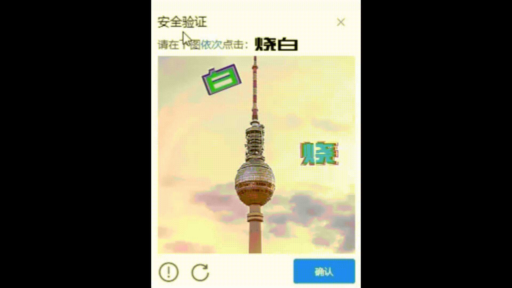
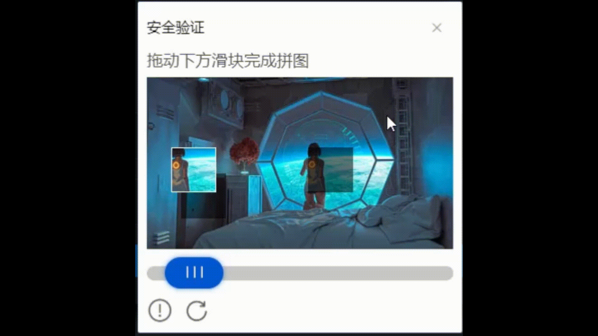
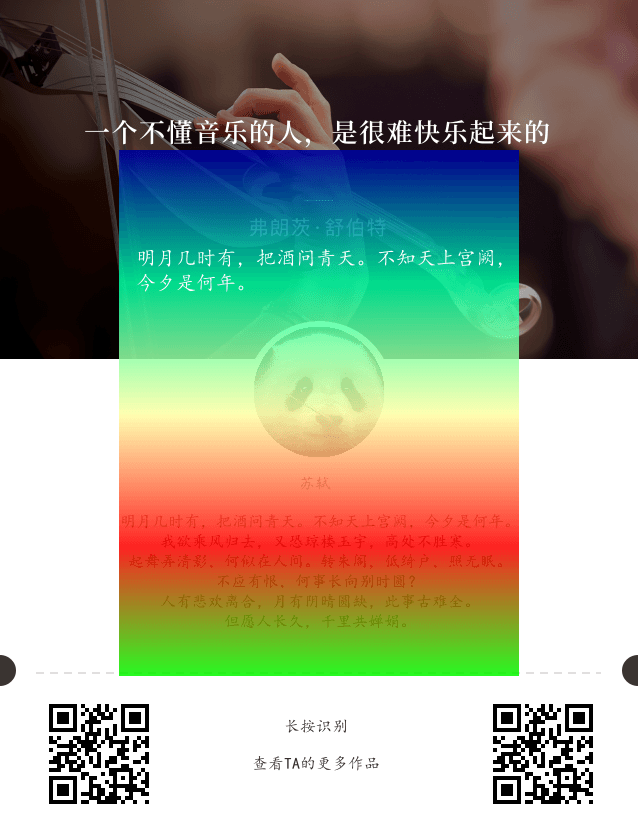

### **poster**

#### 介绍

**得益于 gd、imagick、phpqrcode、wkhtmltopdf**

**主要为了封装一个生成图片便捷的插件，非常感谢使用到的所有工具背后开发者的贡献**

PHP海报生成插件，极速生成方便快捷。

快速生成海报、生成签到日、生成二维码、合成二维码、图片添加水印

滑块验证图片生成、旋转验证图片生成、点击验证图片生成、输入验证图片生成

**小提示：**

**如果无法更新版本，composer 切换回原镜像**

全局设置

composer config -g repo.packagist composer https://repo.packagist.org

#### authors
lang
732853989@qq.com

群号 590660254 [点击链接加入群聊【海报图片验证交流群】](https://jq.qq.com/?_wv=1027&k=k374FhrR)

#### 使用文档

> 文档地址：http://www.520yummy.com/poster-doc/

#### 安装或更新

1.  composer require kkokk/poster
2.  composer update kkokk/poster

#### 演示效果

##### **输入验证码验证**

数字、算术、中文、字母加数字

##### **点击图片验证**

##### 旋转图片验证

##### 滑块验证图片

##### 海报生成图片示例

演示地址：暂无

​	生成签到日历海报、邀请海报

> 注意：没有特别说明，统一都是px。
